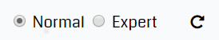

# Matching Game

This is a web game that requires you to match pairs of cards. The less moves you take the higher score you get. You can choose **Expert** mode for more challenges.

## How to Play

1. Click on a card to turn it over.
    * You can only open 2 cards at the same time.
    * If the 2 cards have the same image, they will match and keep showing.
    * If the 2 cards are not same, the will close in 1 second.
2. Once all cards are matched, you win the game.

* Click on `Normal` or `Expert` to choose difficulty level.
* You can restart game at anytime by clicking `Restart` button.

## Parts of the Game

### Deck
The deck has 16 cards, composed of 8 pairs, face down in random order.\

### Score Panel
Here shows the moves and time you spend in a game. \

### Difficulty selection & restart

## Planned Changes
* A new difficulty that will be more challenging: if no cards are matched in 3 continuous moves, a pair of matched cards will close and switch positions with 2 other cards.
* Add theme selection: different sets of images for cards.
* Add sound effects.

## Author
Chenyu Zheng
zcy9998@gmail.com
