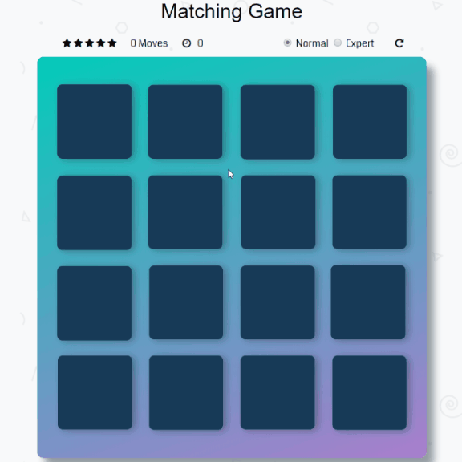

# Matching Game

This is a web game that requires you to match pairs of cards. The less moves you take the higher score you get. You can choose **Expert** mode for more challenges.

## Parts of the Game

* **Star Rating:** Your score is rated by number of stars.
* **Move Count:** Each pair of cards that you open (no matter match or not) will increase the number by 1. This number affects your `star rating`.
* **Timer:** Shows how many secods you spend. This is just for your reference; it will **not** affect your `star rating`.
* **Difficulties:** Once you change difficulty, the game will restart.
* **Restart:** You can restart game at anytime by clicking this button.

* **Deck:** The deck has 16 cards, composed of 8 pairs, face down in random order.

## How to Play

1. Click on a card to turn it over.
    * You can only open 2 cards at the same time.
    * If the 2 cards have the same image, they will match and keep showing.
    * If the 2 cards are not same, they will close in 1 second.
2. Once all cards are matched, you win the game. Your scores will show on the page.

* In `Expert` mode, two random cards that haven't been matched will be swaped every 3 moves.

## Planned Changes
* A new difficulty that will be more challenging: if no cards are matched in 3 continuous moves, a pair of matched cards will close and switch positions with 2 other cards.
* Add theme selection: different sets of images for cards.
* Add sound effects.

## Author
Chenyu Zheng
zcy9998@gmail.com
